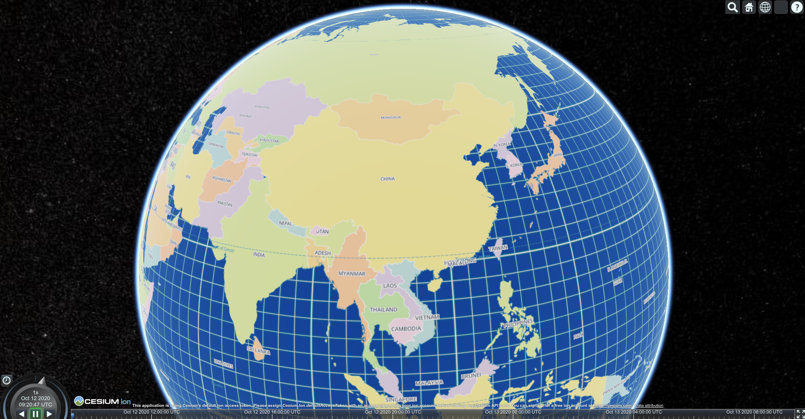
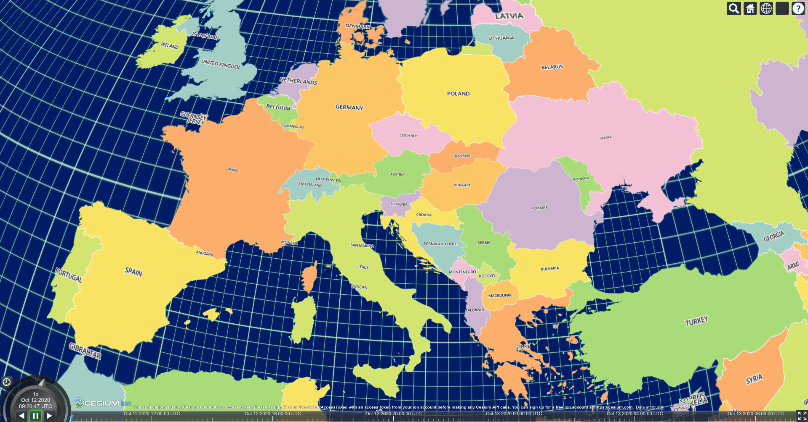

Render Mapbox style in CesiumJs. This project is very simple, because the complex rendering task is compeleted by mapbox-gl-js, you should also check [Mapbox-vector-tiles-basic-js-renderer](https://github.com/landtechnologies/Mapbox-vector-tiles-basic-js-renderer) for more detail.

[中文README](README-zh.md)

### How to use

Clone the project and then place the file in src to appropriate folder.

1. construct ImageryProvider instance
   ```javascript
   let options = {
     style: Object // Mapbox Style Object, required.
     cesiumViewer: Cesium.Viewer // Cesium Viewer Instance, required.
   }
   let provider = new ImageryProvider(options)
   ```
2. add ImageryProvider instance to Cesium Viewer 
   ```javascript
   cesiumViewer.imageryLayer.addProvider(provider)
   ```

### Example
There is an simple example, see example folder.
run：
```shell
git clone https://github.com/kikitte/MVTImageryProvider.git
cd MVTImageryProvider/example
npm i
npm start
```

### Screenshots





### Known Issue

1. raster layer & background layer are not supported yet.

### Credit
https://github.com/landtechnologies/Mapbox-vector-tiles-basic-js-renderer
